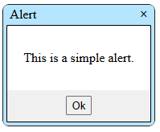

# React-Dialogs

This is a React component I created to provide custom, draggable, and fully resizable dialogs. My goal was to develop a robust and easily customizable dialog component that I could quickly integrate into any future project. I drew inspiration from native Windows popups and JavaScript dialogs. The component includes three types of dialogs: Alert, Confirm, and Prompt. [See it in action here!](https://keytonic.github.io/React-Dialogs)

## Alert

``` JavaScript
import { Alert } from './components/Dialogs';

export default function App()
{
    const [showAlert, setShowAlert] = useState(true);

    function handleAlert(props)
    {
        if(props.hasOwnProperty("anAlertDemo") == true)
        {
            setShowAlert(props.anAlertDemo);
        }
    }

    return(
            <Alert 
                name="anAlertDemo"
                title="Alert"
                message="This is a simple alert." 
                visible={showAlert}
                handler={handleAlert}
            />
    );
}
```
Optionally, you can specify <span style="background-color:rgb(61, 61, 61)">width</span> and <span style="background-color:rgb(61, 61, 61)">height</span> props to achieve the desired dimensions.


## Confirm

## Prompt

